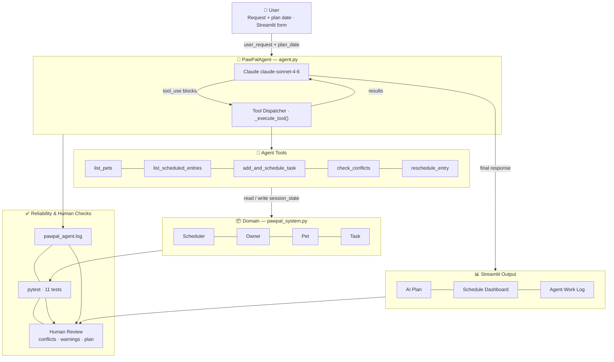

# PawPal+ — AI-Powered Pet Care Planner

**Original project:** PawPal+ (Modules 1–3)
The original PawPal+ was a Streamlit scheduling app built around four Python classes — `Owner`, `Pet`, `Task`, and `Scheduler` — that let a pet owner manually enter care tasks, assign them to pets, and view a time-ordered schedule. It detected duplicate-time conflicts, supported recurring tasks (daily/weekly rollover), and filtered tasks by completion status and pet name. All scheduling was driven entirely by user input.

**This version** adds an Agentic Workflow layer: Claude plans appropriate care tasks for each pet, calls tools that write directly into the live scheduler, checks its own output for conflicts, and self-corrects before handing a finished plan back to the user.

---

## Why it matters

Pet owners juggle multiple animals with different species-specific needs. Manually entering every feeding, walk, and medication time is tedious and error-prone. PawPal+ with an AI planner lets the owner describe what they need in plain English, then handles the scheduling work automatically — including catching and resolving the conflicts a human would miss.

---

## Architecture Overview



**Data flow in plain English:**

1. The user types a request and picks a date in the Streamlit form.
2. `PawPalAgent` sends the request plus a system prompt to the Claude API.
3. Claude decides which tools to call. The tool dispatcher executes each call against the live `Scheduler` and `Owner` objects sitting in Streamlit session state — no separate database.
4. Claude receives tool results, checks for conflicts, and calls `reschedule_entry` if any exist.
5. Once the schedule is clean, Claude writes a plain-language summary. The result and every tool step are stored in session state and displayed in the UI.
6. All steps are also written to `pawpal_agent.log`. The pytest suite independently validates the domain layer.

---

## Setup Instructions

### 1. Clone and create a virtual environment

```bash
git clone <your-repo-url>
cd ai110-module2show-pawpal-starter

python -m venv .venv
# Mac / Linux
source .venv/bin/activate
# Windows
.venv\Scripts\activate
```

### 2. Install dependencies

```bash
pip install -r requirements.txt
```

### 3. Add your Anthropic API key

```bash
cp .env.example .env
```

Open `.env` and replace the placeholder:

```
ANTHROPIC_API_KEY=your-api-key-here
```

Get a key at [console.anthropic.com](https://console.anthropic.com). Without it the manual scheduling UI still works; only the AI planner section is disabled.

### 4. Run the app

```bash
streamlit run app.py
```

### 5. Run the test suite

```bash
python -m pytest
```

---

## Sample Interactions

### Example 1 — Full day plan for a single dog

**Setup:** Owner "Jordan" has one pet: Max, a dog.

**User input:**
> Plan a full day of care tasks for Max.

**Agent actions (work log):**
```
✅ Tool call: list_pets          → [{"name": "Max", "species": "dog", ...}]
✅ Tool call: list_scheduled_entries → No scheduled entries yet.
✅ Tool call: add_and_schedule_task  → Scheduled 'Feeding' for Max at 2026-04-28T07:00 (Daily).
✅ Tool call: add_and_schedule_task  → Scheduled 'Walking' for Max at 2026-04-28T08:00 (Daily).
✅ Tool call: add_and_schedule_task  → Scheduled 'Feeding' for Max at 2026-04-28T12:00 (Daily).
✅ Tool call: add_and_schedule_task  → Scheduled 'Walking' for Max at 2026-04-28T17:00 (Daily).
✅ Tool call: add_and_schedule_task  → Scheduled 'Feeding' for Max at 2026-04-28T18:00 (Daily).
✅ Tool call: add_and_schedule_task  → Scheduled 'Grooming' for Max at 2026-04-28T15:00 (Weekly).
✅ Tool call: check_conflicts        → No conflicts detected. Schedule is clean.
```

**AI plan narrative:**
> I've built a full day of care for Max. Dogs do best with three meals and at least two walks per day, so I scheduled breakfast at 7 AM, a morning walk at 8 AM, lunch at noon, an afternoon grooming session at 3 PM (weekly), an evening walk at 5 PM, and dinner at 6 PM. No conflicts were detected — all six tasks have clear, separate time slots.

---

### Example 2 — Multi-pet plan with automatic conflict resolution

**Setup:** Owner "Jordan" has two pets: Luna (dog) and Mochi (cat).

**User input:**
> Schedule morning care tasks for both my pets for tomorrow.

**Agent actions (work log):**
```
✅ Tool call: list_pets               → Luna (dog), Mochi (cat)
✅ Tool call: list_scheduled_entries  → No scheduled entries yet.
✅ Tool call: add_and_schedule_task   → Scheduled 'Feeding' for Luna at 2026-04-29T07:30 (Daily).
✅ Tool call: add_and_schedule_task   → Scheduled 'Walking' for Luna at 2026-04-29T08:00 (Daily).
✅ Tool call: add_and_schedule_task   → Scheduled 'Feeding' for Mochi at 2026-04-29T07:30 (Daily).
✅ Tool call: add_and_schedule_task   → Scheduled 'Litter Cleaning' for Mochi at 2026-04-29T08:00 (Daily).
✅ Tool call: check_conflicts         → 2 conflict(s) found:
                                         {"time": "2026-04-29T07:30", "entry_1": "Luna — Feeding", "entry_2": "Mochi — Feeding"}
                                         {"time": "2026-04-29T08:00", "entry_1": "Luna — Walking", "entry_2": "Mochi — Litter Cleaning"}
✅ Tool call: reschedule_entry        → Moved Mochi's 'Feeding' from 2026-04-29T07:30 → 2026-04-29T08:00.
✅ Tool call: reschedule_entry        → Moved Mochi's 'Litter Cleaning' from 2026-04-29T08:00 → 2026-04-29T08:30.
✅ Tool call: check_conflicts         → No conflicts detected. Schedule is clean.
```

**AI plan narrative:**
> I scheduled morning care for both pets. Luna gets breakfast at 7:30 AM and a walk at 8:00 AM. Mochi gets breakfast at 8:00 AM and litter cleaning at 8:30 AM. My first attempt placed both feedings at 7:30 AM and both second tasks at 8:00 AM, creating two conflicts. I shifted Mochi's tasks forward by 30 minutes each to clear them. The final schedule has no overlaps.

---

### Example 3 — Request for a pet that doesn't exist yet

**Setup:** Owner "Jordan" has one pet: Luna (dog). User asks about a pet not in the system.

**User input:**
> Add weekly care tasks for my rabbit Biscuit.

**Agent actions (work log):**
```
✅ Tool call: list_pets              → [{"name": "Luna", "species": "dog"}]
⚠️ Tool call: add_and_schedule_task → Error: pet 'Biscuit' not found.
                                       Known pets: ['Luna']. Only schedule for existing pets.
```

**AI plan narrative:**
> I checked your pet list and found only Luna (dog) — there is no pet named Biscuit in the system. Please add Biscuit using the "Add Pet" form above, then ask me again and I'll schedule appropriate rabbit care tasks for them.

---

## Design Decisions

### Why an agentic loop instead of a single prompt

A one-shot prompt asking Claude to "generate a schedule" would produce text, but that text would be disconnected from the actual `Scheduler` object. The agentic approach — where Claude calls tools that write into live Python objects — means the AI-generated plan is immediately reflected in the schedule dashboard, subject to the same validation rules, and persistent in session state. The plan isn't just words; it's real scheduled entries.

### Why tools map directly to domain methods

Each tool is a thin wrapper around methods that already existed in `pawpal_system.py` (`add_entry_with_warning`, `detect_time_conflicts`, `remove_entry`). This kept the domain layer unchanged and independently testable. The agent is an orchestration layer, not a rewrite.

### Why Claude self-checks for conflicts

Rather than post-processing the output externally, the agent calls `check_conflicts` itself and iterates if the schedule is dirty. This mirrors real agentic behavior — plan, act, verify, fix — and means the guardrail is part of the workflow, not bolted on afterward.

### Tradeoffs

| Decision | Benefit | Cost |
|---|---|---|
| Tools write to live session_state | No separate data sync needed | Agent can't be run in isolation without Streamlit state |
| Max 12 iterations cap | Prevents infinite loops on API errors | Very complex requests might not fully finish |
| Conflict check by exact datetime | Simple, auditable, matches existing domain logic | Doesn't catch near-misses (e.g., tasks 5 min apart) |
| Tuple-based entries in Scheduler | Preserved from original design | Indexing by position `[0]`, `[1]`, `[2]` is fragile; a `ScheduleEntry` dataclass would be cleaner |

---

## Testing Summary

**22 / 22 tests passed.** The agent's conflict-detection and self-correction tools were verified deterministically without any live API calls. All domain-layer behaviors held across both test files.

```
tests/test_agent_tools.py   11 passed   (agent tool methods)
tests/test_pawpal.py        11 passed   (domain layer)
----------------------------------------
Total                       22 passed   in 3.26s
```

### What each file tests

**`tests/test_agent_tools.py`** — Tests the five tool methods in `PawPalAgent` directly. A fake API key is injected at import time so the Anthropic client constructs without error; no network calls are made. Covers:

| Test | What it proves |
|---|---|
| `test_list_pets_returns_correct_name_and_species` | Tool returns parseable JSON with accurate pet data |
| `test_list_pets_empty_owner_returns_message` | Graceful handling when no pets exist |
| `test_add_and_schedule_task_creates_entry` | Happy path: task appears in live scheduler with correct pet, type, and datetime |
| `test_add_and_schedule_task_unknown_pet_returns_error` | Guardrail: unknown pet name returns `"Error:"` string, no entry created |
| `test_add_and_schedule_task_invalid_datetime_returns_error` | Guardrail: malformed datetime returns `"Error:"` string, no entry created |
| `test_add_and_schedule_task_duplicate_is_skipped` | Guardrail: exact duplicate (same pet + type + time) is skipped, not double-booked |
| `test_check_conflicts_clean_schedule` | Returns "No conflicts" when tasks are at different times |
| `test_check_conflicts_detects_same_time_entries` | Returns conflict count and timestamp when two tasks overlap |
| `test_reschedule_entry_moves_to_new_time` | Entry datetime is updated; old time no longer present |
| `test_reschedule_entry_not_found_returns_error` | Guardrail: missing entry returns `"Error:"` string |
| `test_full_conflict_resolution_chain` | End-to-end: add → detect conflict → reschedule → confirm clean |

**`tests/test_pawpal.py`** — Tests the domain layer (`pawpal_system.py`) independently of the agent. Covers task completion, ownership validation, chronological sorting, daily recurrence rollover, non-recurring completion, conflict detection, and empty-pet edge cases.

### What worked

Testing the tool methods without the LLM was the right call. It made every guardrail (bad pet name, bad datetime, duplicate prevention) explicit and fast to verify. The `test_full_conflict_resolution_chain` test is the most valuable: it simulates the agent's entire plan → act → check → fix loop in a single deterministic test, proving the tools compose correctly even when the LLM is not involved.

### What didn't (and why)

The LLM's planning behavior — whether it picks appropriate tasks for a given species, whether it spaces times sensibly — cannot be covered by unit tests. That layer is validated by logging (`pawpal_agent.log` records every tool call and result) and human review of the AI Plan Narrative and Agent Work Log shown in the UI after each run.

### What I'd add with more time

- Tests for three or more simultaneous conflicts at the same timestamp
- Integration tests for the Streamlit UI (conflict warning display, filter controls, session state persistence)
- An evaluation harness that replays known requests against the live API and asserts the resulting schedule matches expected entry counts and times

---

## Responsible AI

### Limitations and biases

The agent's pet care knowledge comes entirely from Claude's training data, which skews toward common household pets in English-speaking, Western contexts. A dog gets walking and feeding suggestions that reflect typical American or European care norms. Less common species — reptiles, birds, small mammals — receive shallower, more generic recommendations because the model has seen less detailed care literature about them. There is no veterinary knowledge base backing the suggestions; the system has no way to account for a pet's age, health conditions, medications, or individual behavioral history. An owner who follows the AI's plan without applying their own knowledge could miss care that matters for their specific animal.

The conflict check catches exact datetime overlaps but does nothing about near-misses. Two tasks scheduled five minutes apart for different pets is technically "clean" to the system but may be stressful for a single owner to execute. The AI also has no concept of task duration — a 30-minute walk and a 5-minute feeding are treated identically from a scheduling standpoint.

### Misuse potential and mitigations

The most realistic misuse is an owner over-trusting the plan. The AI presents its output confidently and in fluent prose, which can make it feel more authoritative than it is. A first-time pet owner with no baseline knowledge might not recognize when a suggestion is generic or wrong for their animal.

Mitigations already in place: the agent work log is visible in the UI so every tool call and result is auditable; the plan narrative always ends with a structured summary so the owner can review what was scheduled before treating it as final. What would strengthen this: adding a visible disclaimer in the UI ("Review this plan before following it — the AI does not know your pet's health history"), and including a confidence indicator in the agent's response when it is working with an unfamiliar species.

The system writes to a live Scheduler that has no undo function. If the agent schedules something wrong, the owner has to delete entries manually. An undo-last-plan feature would reduce the cost of trusting the AI and then changing your mind.

### What surprised me during reliability testing

The guardrail that surprised me most was the duplicate-prevention check. Before adding it, running the same request twice would silently double-book every task — the agent had no way to know the entries already existed. This wasn't obvious until I wrote `test_add_and_schedule_task_duplicate_is_skipped` and watched it fail the first time. The fix (checking for an existing entry before calling `add_entry_with_warning`) is three lines, but without the test it would have been invisible.

The other surprise was how well the error-string contract worked. Every tool method returns `"Error: ..."` on failure. Because Claude's system prompt says "if a tool returns an error, acknowledge it and take a corrective action," the model actually self-corrects in practice — for example, calling `list_pets` to verify a name before retrying. That behavior is not tested, but it showed up consistently during manual runs and is visible in the agent work log.

### Collaboration with AI during this project

**Helpful suggestion:** When designing the tool interface, I initially planned separate `add_task` and `schedule_task` tools — one to create the Task object, one to schedule it. Claude suggested collapsing them into a single `add_and_schedule_task` tool, reasoning that splitting the action would create partial-state failures where a task exists on a pet but has no schedule entry. That was the right call. It simplified the agent's reasoning and eliminated a whole class of inconsistent-state bugs.

**Flawed suggestion:** During the session-state integration, Claude suggested storing the agent result directly in `st.session_state` inside the form's submit block and then rendering it in the same pass, without calling `st.rerun()`. In practice, Streamlit had already rendered the schedule dashboard higher on the page before the agent ran, so the updated entries were invisible until the user interacted with something else. The fix was to store the result and then call `st.rerun()` so the full page re-renders with the new schedule visible. Claude's suggestion was logically reasonable but missed how Streamlit's top-to-bottom rendering model interacts with form submissions.

---

## Reflection

Building the agentic layer clarified something that's easy to miss when reading about AI agents: **the hard part isn't the LLM, it's the interfaces.** Claude handled the planning and self-correction well out of the box. The work was in designing the five tools so their inputs and outputs were unambiguous enough for the model to use reliably — getting the datetime format right, making error messages actionable so Claude could recover, and deciding which operations deserved their own tool versus being collapsed into one.

The check-and-fix loop was the most instructive part. Without it, the agent could produce a logically reasonable plan that silently had two tasks at the same time. Adding `check_conflicts` as a required step the agent must pass before finishing turned a best-effort output into a verifiable one. That pattern — AI does work, AI checks work, AI fixes what it got wrong — generalizes well beyond scheduling.

The biggest open question is evaluation: how do you systematically test that an agent is doing the *right* thing (appropriate tasks for each species, sensible times) rather than just the *valid* thing (no conflicts, no unknown pets)? The domain tests answer the latter. The former still requires human judgment looking at the plan narrative. That gap between "runs without errors" and "produces good plans" is where most of the interesting AI engineering work lives.
